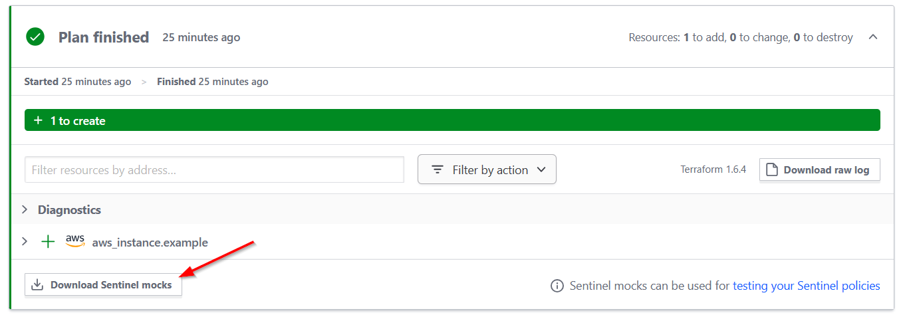
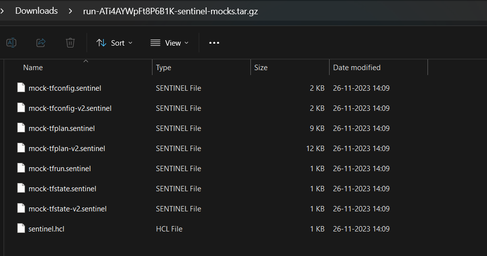
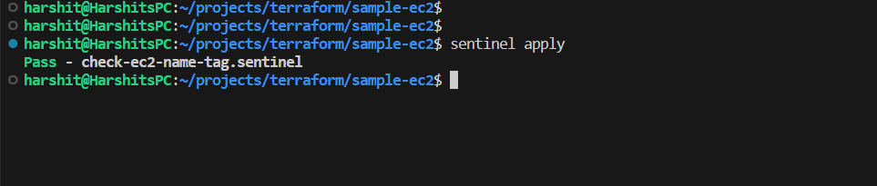

# Testing out Hashicorp Sentinel

Sentinel is used to write policies, and the workflow looks like this:

```
Terraform code -> tfplan -> Sentinel Check (if passed)-> tfapply
```

The file structure of the repository looks like this:

```
|-- main.tf [or more terraform code]
|
|-- mocks\
|----- mock-tfplan.sentinel
|----- mock-tfplan-v2.sentinel
|
|-- policies\
|----- check-ec2-name-tag.sentinel
|
|-- sentinel.hcl
```

## Environment setup

Install the following:

1. `terraform` : https://developer.hashicorp.com/terraform/tutorials/aws-get-started/install-cli

2. `sentinel` : 
```
cd /tmp && wget https://releases.hashicorp.com/sentinel/0.23.1/sentinel_0.23.1_linux_amd64.zip

unzip sentinel_0.23.1_linux_amd64.zip

sudo mv sentinel /usr/local/bin/sentinel
```

Configure Terraform cloud; by creating a workspace on tfcloud and adding the following code (to be obtained on tfcloud) in your existing tf code:

```
terraform {
  cloud {
    organization = "example-org-aabbcc"

    workspaces {
      name = "example-name"
    }
  }
}
```

## What are mocks?

A mock is just a file which contains tfplan's output in a formatted way. These files are necessary to use `sentinel`, as it uses these files only to perform the policy checks. 

__Why v1 and v2?__
It's the same data in different format. Although it is recommended to use the v2 version of the mock.

### The problem with mocks

Mock files are the necessity for using sentinel, but they are generated using __Terraform Cloud__ (using UI or it's API) and __cannot__ be generated using Terraform CLI.

So it poses this need to use Terraform Cloud for using sentinel in your project.

In the Terraform Cloud, when you perform the `plan` on your code, then ou get the option to download the mock files:



The mock files are then downloaded as a tarball file:



And you can copy-paste them in your project repo.

## What is sentinel.hcl?

It is the configuration file for sentinel. In this file we tell sentinel the positions for mocks and policies. Example:

```
mock "tfplan" {
  module {
    source = "./mocks/mock-tfplan.sentinel"
  }
}

mock "tfplan/v2" {
 module {
    source = "./mocks/mock-tfplan-v2.sentinel"
  }
}

policy "check-ec2-name-tag" {
  source = "./policies/check-ec2-name-tag.sentinel"
  enforcement_level = "hard-mandatory"
}
```

Make sure that `sentinel.hcl` is present in the root of the project.

## Writing sentinel policies

Now after setting up your file structure, you are going to write sentinel policies in the `policies\` directory.

Don't forget to mention the policies' name in the `sentinel.hcl` file as well.

Now sentinel is going to perform checks on the mocks, for the policies that you're going to write. In this example, we are checking for mandatory Name tag and allowed instance types.

When you execute `sentinel apply`, it shows the status:



It'll pass if the terraform code is compliant to the written policies.

# My take

* Writing sentinel policy is very much dependent on the terraform code you wrote, and the plan it is going to produce.

* It is more or less like checking for key-value pairs in a json file [The Mock File]

* It also need to use an extra service to generate the mock files. It is okay, if we are going to use Terraform Cloud as the main runner of our terraform code, which might not be the case every time. So it incorporates extra complexity to do a simple task:

CHECKING FOR SOME KEY-VALUE PAIRS IN A FILE

### What about generating the mock file usinng terraform CLI?

Simply stating, it cannot be done using CLI.

But for another approach, we can produce a JSON File containig tfplan contents pretty easily. And then use this file to perform similar checks using maybe `python` or a `bash script`.

To generate the tfplan json, follow the following steps after `terraform init`:

```
terraform plan -out=tfplan.binary

terraform show -json tfplan.binary | jq > tfplan.json
```

This is going to generate `tfplan.json`.